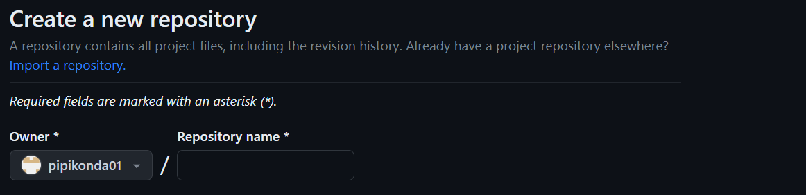
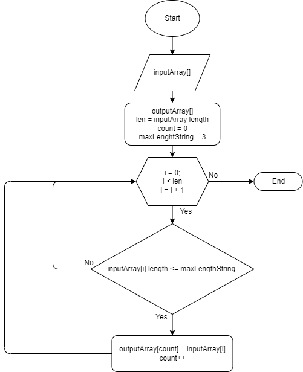

# Итоговая контрольная работа по основному блоку
## Урок 1. Контрольная работа
#### Данная работа необходима для проверки ваших знаний и навыков по итогу прохождения первого блока обучения на программе Разработчик. Мы должны убедится, что базовое знакомство с IT прошло успешно.

Задача алгоритмически не самая сложная, однако для полноценного выполнения проверочной работы необходимо:

1. Создать репозиторий на GitHub
2. Нарисовать блок-схему алгоритма (можно обойтись блок-схемой основной содержательной части, если вы выделяете её в отдельный метод)
3. Снабдить репозиторий оформленным текстовым описанием решения (файл README.md)
4. Написать программу, решающую поставленную задачу
5. Использовать контроль версий в работе над этим небольшим проектом (не должно быть так, что всё залито одним коммитом, как минимум этапы 2, 3, и 4 должны быть расположены в разных коммитах)
# 1. Создать репозиторий на GitHub
Войдите на gitHUB и через иконку своего аккаунта перейдите в раздел «репозитории», там через кнопку «New» создайте новый репозиторий:

Далее необходимо придумать название своему репозиторию:     

И в конце необходимо просто скопировать из подсказки:

# 2. Нарисовать блок-схему алгоритма
Блок схему я создал на сайте draw.io, и прикреплю её в виде картинки:
 
# 3. Снабдить репозиторий оформленным текстовым описанием решения (файл README.md)
Это и есть данный файлик :DDD
# 4. Написать программу, решающую поставленную задачу
Задача хранится отдельно в папке "Work"
# 5. Использовать контроль версий в работе над этим небольшим проектом